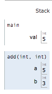
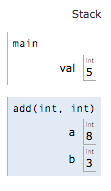
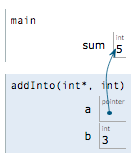
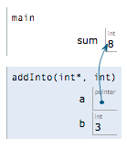
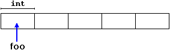
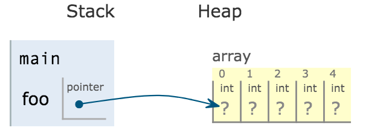

# Lab 07: Pointers

Welcome to CSC 211 Lab 08. Your goal for this lab will be to gain a better understanding of pointers. **Be sure to read and follow all instructions unless otherwise specified.**  Create a `lab-08.txt` document to record all of your lab answers in and implement all of your `.cpp` programs in your IDE. Some of the language in this lab has been adopted from `cplusplus.com/doc/tutorial/dynamic/`.

1. C-style pointers<br> 
2. Multidimensional Arrays<br>
3. Dynamic Memory (New / Delete) <br>
3.1 Operators new and new[] <br>
3.2 Operators delete and delete[] <br>
4. Submission <br>

# Part 1. C-style Pointers
As we learned in class, a pointer (\*) is a reference to a memory address. By itself, a pointer cannot help us perform most of the tasks we've grown accustomed to doing, such as storing data. Instead, pointers allow us to pass data around our program in a different manner than we have been doing thus far, allocate memory during the programs execution, and even store pointers to functions into arrays, allowing us to pass some value to multiple functions via a loop. What fun!

The focus of today's lab will be the simplest of pointer usage; to pass a variable's memory address to a function.

If I were to ask you to write a void function that accepts two integers, *a* and *b*, then adds the value of *b* into *a*, you may do the following:

```c++
void add(int a, int b);

int main(){
  int val = 5;
  add(val, 3);
  std::cout << val << std::endl;
}

void add(int a, int b){
  a += b;
}
```
But the issue with this function is that since the add function has two integers as its parameters, every time this function is called it has two new memory locations for *a* and *b*, that hold copied values of whatever was given to them. Visually, it looks something like this.




Then after the addition occurs, we end up with this:



Since these variables are both local to the add() function, they disappear when the function exits and our 8 value is lost. This is exactly the issue that a pointer would fix. Instead of a being a new variable with its own memory address, we want it to point to an existing memory address.

```c++
void addInto(int* a, int b);

int main()
{
	int sum = 5;

	addInto(&sum, 3);
	std::cout << sum << std::endl;
}

void addInto(int* a, int b) {
	(*a) += b;
}
```

There are a few changes to the above code. First, our function accepts an integer pointer *a*, and an integer *b*, as opposed to the two integers it previously had. Second, instead of passing *sum* directly into the function call, we use the '&' to specify we want to pass the **memory address** of *sum*. Third, in our function we specify that we first want to **de-reference** *a* **prior** to performing the addition. Visually, our initial setup is this:



And the result after the addition is this:




:white_check_mark: 1. Create a void function called *square* that accepts an integer pointer and stores the square of that number into the passed address. Print this number in main.

:white_check_mark: 2. Write a void function *countEvens* that accepts an array and an integer pointer. The pointer should be used to count the # of even numbers in the array. Be sure to de-reference properly!

:white_check_mark: 3. What does the following code output? (You can assume it compiles).

```c++
#include <iostream>

int main() {
	int nums[] = {5, 10, 15, 20};
	int *x = &nums[2];
	int *y = x+1;
	std::cout << *x + *y;
}
```

:white_check_mark: 4. What does the following code output? (You can assume it compiles).

```c++
    #include <iostream>

    void foo(int x, int *someP) {
        *someP = x + 1;
        x = 80;
    }

    int main() {
        int a = 30;
        int b = 60;
        int *p = &a;
        int *z = &b;

        *p = 12;
        b = a;
        *p = 21;

        std::cout << "1: a=" << a << ", b=" << b << std::endl;
        foo(a, z);
        std::cout << "2: a=" << a << ", b=" << b << std::endl;

        *p = 1;
        p = z;
        *p = 3;

        std::cout << "3: a=" << a << ", b=" << b << std::endl;

        return 0;
    }

```

# Part 2. Multi-dimensional Arrays

Multi-dimensional arrays allow us to *gasp* store multiple dimensions worth of data!

The normal rules of arrays apply: you cannot determine the size of array outside the scope it is declared in, and you must specify the size of the dimensions. Well, except for the first one.

Lets take a look at the following code. In it, we have two functions: fillArray() and printArray(). Note that I am using a *const int* to determine the size of my array. This makes changing the size of my array dimensions easier. The fillArray() function simply creates 5 rows of {0, 1, 2, 3, 4}, while the printArray() function does what it says its does.

```c++
const int arrSize = 5;

void fillArray(int arr[][arrSize]);
void printArray(int arr[][arrSize]);

int main()
{
	int myArr[arrSize][arrSize];
	
	printArray(myArr);
	fillArray(myArr);
	printArray(myArr);
}

void fillArray(int arr[][arrSize]) {
	for (int i = 0; i < arrSize; i++) {
		for (int j = 0; j < arrSize; j++) {
			arr[i][j] = j;
		}
	}
}

void printArray(int arr[][arrSize]) {
	for (int i = 0; i < arrSize; i++) {
		for (int j = 0; j < arrSize; j++) {
			std::cout << arr[i][j] << " ";
		}
		std::cout << std::endl;
	}
	std::cout << std::endl;
}
```

The printArray() call prior to the fillArray() call prints out a 5x5 array of random values. Why is that?
When you declare an array without initializing it, you end up with an array filled with garbage values. Essentially, whatever was in that location in memory ends up in your array.

Wait a minute. the fillArray() function accepts an array (not a pointer to an array!), and is of type *void*. How are the values leaving the fillArray() function and displaying correctly in printArray()!?

As covered in lecture, the short answer; arrays are themselves references. This holds true for multi-dimensional arrays as well, regardless of the number of dimensions!

:white_check_mark: 5. Re-write the fillArray() function in the example above to store a multiplication table (without the headers) into *arr*. e.g. for *arrSize = 3* the array should be filled as:<br>
1 2 3<br>
2 4 6<br>
3 6 9<br>

:white_check_mark: 6. Write a program that will store 3 exam grades for 4 students as amultidimensional array, and a function to calculate the average for each student, and another function to calculate the average for each exam. 

# Part 3. Dynamic Memory (New / Delete)

Dynamic memory is memory stored on what is known as the **heap**. This is where values that are unknown at compile time, hence not valid for the stack, are going to have to be stored. This allows for us to store things like variable length arrays in a program and operate on them accordingly.

## 3.1 Operators new and new[]

Dynamic memory is allocated using operator `new`. `new` is followed by a data type specifier and, if a sequence of more than one element is required, the number of these within brackets []. It returns a pointer to the beginning of the new block of memory allocated. Its syntax is:

`pointer = new type` <br>
`pointer = new type [number_of_elements]`


The first expression is used to allocate memory to contain one single element of type type. The second one is used to allocate a block (an array) of elements of type type, where number_of_elements is an integer value representing the amount of these. For example, consider the code below:

```c++
int * foo;
foo = new int [5];

```

In this case, the system dynamically allocates space for five elements of type int and returns a pointer to the first element of the sequence, which is assigned to foo (a pointer). Therefore, foo now points to a valid block of memory with space for five elements of type int.



Here, foo is a pointer, and thus, the first element pointed to by foo can be accessed either with the expression foo[0] or the expression *foo (both are equivalent). The second element can be accessed either with foo[1] or *(foo+1), and so on...

There is a substantial difference between declaring a normal array and allocating dynamic memory for a block of memory using new. The most important difference is that the size of a regular array needs to be a constant expression, and thus its size has to be determined at the moment of designing the program, before it is run, whereas the dynamic memory allocation performed by new allows to assign memory during runtime using any variable value as size.

The dynamic memory requested by our program is allocated by the system from the memory heap. However, computer memory is a limited resource, and it can be exhausted. Therefore, there are no guarantees that all requests to allocate memory using operator new are going to be granted by the system. We can see this behavior in memory for the exact block of code you just saw using the `new` command.



Notice that this array was allocated on the `heap` because of the `new` command.

C++ provides two standard mechanisms to check if the allocation was successful:

One is by handling exceptions. Using this method, an exception of type bad_alloc is thrown when the allocation fails. Exceptions are a powerful C++ feature explained later in these tutorials. But for now, you should know that if this exception is thrown and it is not handled by a specific handler, the program execution is terminated.

This exception method is the method used by default by new, and is the one used in a declaration like:

```c++
foo = new int [5];  // if allocation fails, an exception is thrown

```

This method can be specified by using a special object called nothrow, declared in header `<new>`, as argument for new:

```c++
foo = new (nothrow) int [5]; 
```

In this case, if the allocation of this block of memory fails, the failure can be detected by checking if foo is a null pointer:
```c++
int * foo;
foo = new (nothrow) int [5];
if (foo == nullptr) {
  // error assigning memory. Take measures.
}
```

This nothrow method is likely to produce less efficient code than exceptions, since it implies explicitly checking the pointer value returned after each and every allocation. Therefore, the exception mechanism is generally preferred, at least for critical allocations. Still, most of the coming examples will use the nothrow mechanism due to its simplicity.

## 3.2 Operators delete and delete[]

In most cases, memory allocated dynamically is only needed during specific periods of time within a program; once it is no longer needed, it can be freed so that the memory becomes available again for other requests of dynamic memory. This is the purpose of operator delete, whose syntax is:

`delete pointer;` <br>
`delete[] pointer;`<br>

The first statement releases the memory of a single element allocated using new, and the second one releases the memory allocated for arrays of elements using new and a size in brackets ([]).

The value passed as argument to delete shall be either a pointer to a memory block previously allocated with new, or a null pointer (in the case of a null pointer, delete produces no effect).

As a **warning**, in C/C++ all memory that is dynamically allocated **must** be manually freed (`delete`'d). The language **will not** do this for you. If you don't free memory before a program finishes it is possible that memory will stay reserved. With no way to free that memory now (as our pointer has been destroyed) we could possibly eventually fill all of our memory and cause our machine to crash. This is extremely unlikely in the scope of this course as nothing we are working on will actually trigger this case, but it should still be mentioned. As long we are working with single dimensional arrays on the heap, this case will be handled by normal execution, but should not be relied on. As soon as you have multi dimensiona arrays on the heap, this memory issue can occur and is a **disasterous** error in your code, this is known as a **memory leak** as we have leaked away some of our systems memory with no way to recover it outside of a full system restart. 

:white_check_mark: 7. Consider the below code and describe what the `delete[]` command is doing. What would happen if we only used `delete`?

```c++

int * foo = new int[5];

for(int i = 0 ; i < 5 ; i++) {
  foo[i] = i;
}

for(int i = 0 ; i < 5 ; i++) {
  std::cout << foo[i];
}

std::cout << std::endl;

delete[] foo;
```

:white_check_mark: 8. Write a program that accepts a number of data points *n*, stores them into an array, and uses a pointer *max* that will point to the largest value. 

:white_check_mark: 9. Create a void function called *findStats* that will calculate the mean, median, and mode of an array of ints of size *n*. Store these values in an array and return this array from the function (note: there is a reason this question is in the dynamic memory section).

# Part 4. Submission

Each group will submit a single **.zip file** named `lab-08.zip` containing all your answers to the lab questions in your `lab-08.txt` and all of your `.cpp` source code files on [Gradescope](http://gradescope.com) **before the end of your lab section**. **All submissions should be made by a group/team.** *Individual submissions will not be accepted.* Instructions to download your `lab-08.txt` file can be found in the IDE introduction page that you read in lab-01. For your convenience, that page is relinked [here](https://cs50.readthedocs.io/ide/online/).


=======
# Lab 06: Strings

Welcome to CSC 211 Lab 06. Your goal for this lab will be to gain a better understanding of strings. **Be sure to read and follow all instructions unless otherwise specified.** Some of the language used here has been adopted from the *OpenDSA Data Structures and Algorithms Modules Collection text* text. Create a `lab-06.txt` document to record all of your lab answers in and implement all of your `.cpp` programs in your IDE.

1. C-style Strings [45 minutes]<br> 
    1.1 How to create a C-style string<br>
    1.2 Accessing a C-style string<br>
    1.3 Modifying a C-style string<br>
2. The *string* class [20 minutes] <br>
    2.1 Creating a string object<br>
    2.2 Storing data as a string object<br>
    2.3 Accessing a string object<br>
    2.4 Manipulating a string object<br>
3. Exercises [30 minutes] <br>
4. Submission [5 minutes]

# Part 1. C-style Strings [45 minutes]
## 1.1 How to create a C-style string
A C-style string is an array of characters that uses the null terminator ('\0') to indicate the end of the string.

To declare & initialize a C-style string, we can do the following: 

```c
  char myString[] = "Hello, World!";
```

This will create a char array containing the string literal, plus the null terminator. Notice that the length of the string is 14. "Hello, World!" takes up 13, and the '\0' character is added to the end. We can visualize the above string as such:

H|e|l|l|o|,| |W|o|r|l|d|!|\0
-|-|-|-|-|-|-|-|-|-|-|-|-|-
0|1|2|3|4|5|6|7|8|9|10|11|12|13

We can also create an array for later use by specifying a size:

```c
    char myString[10];
```

This will create an array of size 10 for us to use. 

:white_check_mark: Question 1. What is the largest size string we could store into this variable?

:white_check_mark: Question 2. What is the largest size string we could store into an arbitrary variable of size n?

:white_check_mark: Question 3. What do you think will happen if a string has no null terminator?

Now its a valid question to wonder why every string must have a null terminator at the end. The answer is actully rather simple, it makes iterating over the string trivial. If we observe the [ASCII table](https://www.bing.com/widget/t/ascii?q=ascii&height=370&pos=1&tag=afcd98f5cab196c1) and look for the ASCII code associated with the character Null we will find that it has ASCII code 0. 

:white_check_mark: Question 4. What does this mean we can do with strings to look for where it ends?

## 1.2 Accessing a C-style string
As shown above, the letters in the array are indexed 0-13. To access a specific letter, place brackets with the index you want after the identifier, like so:

```c
    std::cout << myString[0];
```

This would output the letter 'H'.

If we want to output the entire word, simply cout the identifier:

```c++
    std::cout << myString << std::endl;
```

:white_check_mark: Program 1. Implement in C++ a function with the following header `unsigned int string_len(char str[])` that will return the length of the `str` parameter(not including the null terminator).

## 1.3 Modifying a C-style string
By the same method as above, we can specify a letter to change with brackets & an index:

```c
    myString[7] = 'B';
```

Were we to print myString, we would receive "Hello, Borld!"

To retrieve a string from the user and store it into our C-style string, we can use the [getline() function.](http://www.cplusplus.com/reference/istream/istream/getline/)

```c++
    char myString[10];
    
    std::cin.getline(myString, 10);
```

As the documentation says, getline() will append a null terminator to the end of the string read from the user before it is stored into myString. Be careful when using getline() alongside a regular cin expression inside of the same program, as they tend to not get along. 

:white_check_mark: Program 2. Implement in C++ a function with the following header `void replace(char str[], char a, char b)` that will replace every instance of character `a` in the `str` parameter with character `b`. (We wrote psuedocode for this problem earlier in the semester so feel free to reference it for this problem)

:white_check_mark: Program 3. Implement in C++ a function with the following header `bool palindrome(char str[])` that will return true if the `str` parameter is a palindrome(that is to say that the string is spelled the same way forwards and backwards, E.G. tacocat, racecar, etc.), and false otherwise. For this particular question you can assume you will always et input that is all lowercase and contains no spaces. (**Hint**: your `string_len` function from earlier wll be useful here)

:white_check_mark: Program 4. Implement in C++ a function with the following header `void reverse(char str[])` that will reverse the `str` parameter.

:white_check_mark: Program 5. Implement in C++ a function with the following header `void remove(char str[], char a)` that will remove the first occurence of character `a` from the `str` parameter. (Note: you will have to shift over the rest of the string after removing the character)

:white_check_mark: Program 6. Implement in C++ a function with the following header `void all_to(char str[], bool caps)` that will change all of the characters in the `str` parameter to their uppercase equivalent if `caps` is True or change all of the character in `str` to their lowercase equivalent if `caps` is False.


# 2. The String Class [20 minutes]

In C++, we have access to the string class. This allows us to create a string object. For those interested [here's a link to the c++ reference page on string objects](http://www.cplusplus.com/reference/string/string/), and [here's a link to the C++ reference page on functions that act on string objects](http://www.cplusplus.com/reference/string/). As this is our first STL(Standard Template Library) container we're using this semester don't be scared by all of the information on this page.  

## 2.1 Creating a string object

Creating string objects is very simple. Make sure you include the string library, and all you need is an identifier, like so:

```c++
    #include <string>
    
    std::string myString;
```

You can also create a string initialized with data by invoking the string **constructor**, like so:
> Note: A **constructor** is a member function of a class which initializes objects of a class. In C++, Constructor is automatically called when object(instance of class) create. It is special member function of the class. ([source](https://www.geeksforgeeks.org/constructors-c/))

```c++
    #include <string>
    
    std::string myString("Hello, World!");
```

Notice how for both of these strings, we never specified a size like we had to for the c-style strings. String in C++ are more sophisticated, in that they will resize as need be (providing we use the correct methods to manipulate them!)

We can also initialize a string with another string.
 
```c++
    #include <string>
    
    std::string myString("Hello, World!");
    std::string anotherString(myString);    //Printing this yields "Hello, World!"
```

Or even a concatenation of strings!

```c++
    #include <string>
    
    std::string myString("Hello, World!");
    std::string anotherString(myString + myString); //Printing this yields "Hello, World!Hello, World!"
```

Yet another constructor lets us fill a string with *n* instances of a character!

```c++
    #include <string>
    
    std::string myString(10, 'a');  //Printing this yields "aaaaaaaaaa"
```

## 2.2 Storing data as a string object

There are multiple ways to store data in a string object. We saw above that we can initialize a string in many ways, but what about after it has been created? The primary way of adding data to a string is with the **append()** function.

```c++
    #include <string>
    
    std::string myString("Original Text");
    
    myString.append("Appended Text");   //Printing after this line would yield "Original TextAppended Text"
    
```

Note that you'll need to manually add spaces if you want them between the data already in the string, and what you are adding!

The String object has its own version of the **getline()** function that is used to retrieve data from a file/user.

```c++
    #include <string>
    
    std::string myString;
    std::getline(std::cin, myString);   //Note that when working with files, the file pointer will replace std::cin!
```

## 2.3 Accessing a string object

The data inside of a String is indexed, just like an array. The only difference, is that you'll need to use the String class' **at()** function to access the data, instead of having direct access to it via bracket.

```c++
    #include <string>
    
    std::string myString("A String");
    std::cout << myString.at(2) << std::endl;   //This will print 'S'
```
Since the data is indexed, this means we can loop through the contents of any String object. But in order to do this, we'll need to know how long the String is. Or more accurately, we need to know what the maximum index we can access is. Luckily, the **length()** function has us covered!

```c++
    #include <string>
    
    std::string myString("A string to test .length()!");
    std::cout << myString.length() << std::endl;    //This will print 27.
```

The last one I'll be mentioning for this lab is the **substr()** function. This allows us to extract a substring from a String object. There are two versions of this function, one that takes a single parameter, and another that takes two. Starting with the single parameter version, **substr(i)**, this will return a String containing all data from the *ith* position until the end of the string.

```c++
    #include <string>
    
    std::string myString("Apples");
    std::cout << myString.substr(2) << std::endl;   //This will output "ples"
```

The other version, **substr(i, n)**, will return a String of *n* length starting from the *ith* position. Note that this is ***very*** different from a function that returns all data between *i* and *n*!

```c++
    #include <string>
    
    std::string myString("Apples");
    std::cout << myString.substr(2, 3) << std::endl;    //This will output "ple"
```

There are other functions to access specific parts of a String, but you can read about those in the documentation. You will follow the same method to use each of them: use the **.** operator on a String identifier and fill in the correct parameters that the documentation tells you about.

## 2.4 Manipulating a string object

As mentioned earlier, String objects can change size. This means we can delete elements from a String. The first method we'll cover is the nuclear option, **clear()**. As expected, this function will obliterate any data in your String, resetting it to the empty string "";

```c++
    #include <string>
    
    std::string myString("A string with hopefully not very important data in it!");
    myString.clear();
```

For a little more precision, we can use the **erase(i, n)** function. This will delete *n* characters from the String starting at index *i*. These parameters work the same way as those for **substr(i, n)**.

```c++
	std::string myString("Apples");
	myString.erase(2, 3);   //This will delete indices 2, 3, and 4. Removing letters "ple"
	std::cout << myString << std::endl; //This will output "Aps"
```

One final function I want to cover, is the **replace(i, n, str)** function, which replaces *n* characters starting at index *i*, with the data in *str*. A neater way to think of this, is that it calls **erase(i, n)** then inserts *str* at *i*.

```c++
	std::string myString("Apples");
	myString.replace(1, 4, "lpaca");    //Erases "pple" and inserts "lpaca". Note that these Strings are not the same length!
	std::cout << myString << std::endl; //This will print "Alpacas"
```

# Part 3. Exercises [30 minutes]

:white_check_mark: Question 7. Look through the documentation for the String class. Learn what the **copy()** function does, demonstrate you understand how to use it by writing a function utilizing it, and write a comment explaining what each parameter to the function is, as well as what is happening.

:white_check_mark: Question 8. Look through the documentation for the String class. Learn what the **swap()** function does, demonstrate you understand how to use it by writing a function utilizing it, and write a comment explaining what each parameter to the function is, as well as what is happening.

:white_check_mark: Question 9. Look through the documentation for the String class. Learn what the **insert()** function does, demonstrate you understand how to use it by writing a function utilizing it, and write a comment explaining what each parameter to the function is, as well as what is happening. Note that this function has multiple versions, why is that?


# Part 4. Submission [5 minutes]

Each group will submit a single **.zip file** named `lab-07.zip` containing all your answers to the lab questions in your `lab-07.txt` and all of your `.cpp` source code files on [Gradescope](http://gradescope.com) **before the end of your lab section**. **All submissions should be made by a group/team.** *Individual submissions will not be accepted.* Instructions to download your `lab-07.txt` file can be found in the IDE introduction page that you read in lab-01. For your convenience, that page is relinked [here](https://cs50.readthedocs.io/ide/online/).
